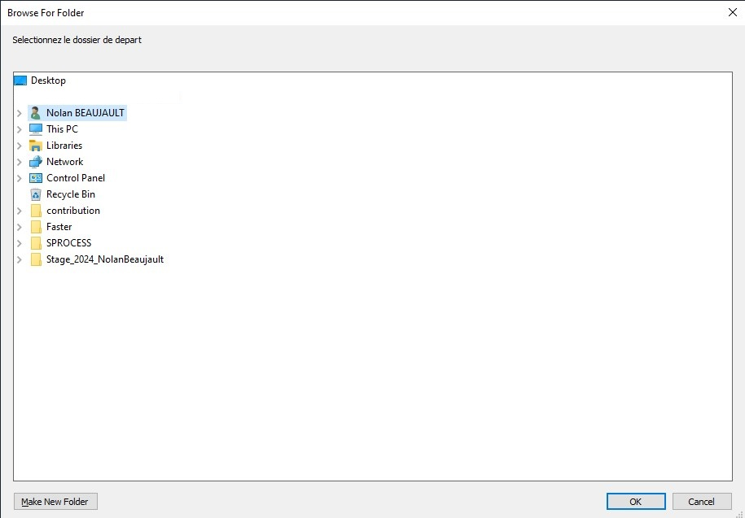

# PowerShell Script for Folder Selection and Copying

I created this script to address a need: moving folders can sometimes be long and tedious, especially when you have to search for subfolders within other subfolders. By specifying the input path, you can directly target a folder.

This PowerShell script allows you to select a source folder and a destination folder, then copy the contents of the source folder to the destination folder. It uses a graphical interface to facilitate folder selection.

## Features

- **Folder Selection**: Uses a graphical dialog box to select the source and destination folders.
- **Folder Copying**: Recursively copies the contents of the source folder to the destination folder.
- **Error Handling**: Displays error messages in case of issues during the copy process.

## Prerequisites

- PowerShell 5.0 or higher
- .NET Framework

## Usage

1. **Set encoding to UTF-8**:
    ```powershell
    [Console]::OutputEncoding = [System.Text.Encoding]::UTF8
    ```

2. **Add the System.Windows.Forms assembly**:
    ```powershell
    Add-Type -AssemblyName System.windows.forms
    ```

3. **Function to select a folder**:
    ```powershell
    Function Select-Folder($description, $defaultPath) {
        $folderBrowser = New-Object System.Windows.Forms.FolderBrowserDialog
        $folderBrowser.Description = $description
        $folderBrowser.ShowNewFolderButton = $true

        if (Test-Path -Path $defaultPath) {
            $folderBrowser.SelectedPath = $defaultPath
        }

        if ($folderBrowser.ShowDialog() -eq "OK") {
            return $folderBrowser.SelectedPath
        }
        else {
            return $null
        }
    }
    ```

4. **Set default paths and select folders**:
    ```powershell
    $defaultSourcePath = "path_to_your_source_folder"
    $cheminSource = Select-Folder "Select the source folder" $defaultSourcePath
    if ($null -eq $cheminSource) {
        Write-Host "No source folder selected."
        exit
    }

    $defaultDestinationPath = "path_to_destination"
    $cheminDestination = Select-Folder "Select the destination folder" $defaultDestinationPath
    if ($null -eq $cheminDestination) {
        Write-Host "No destination folder selected."
        exit
    }
    ```

5. **Copy the folder**:
    ```powershell
    try {
        Copy-Item -Path $cheminSource -Destination $cheminDestination -Recurse -Force
        Write-Host "The folder has been copied from '$cheminSource' to '$cheminDestination'."
    }
    catch {
        Write-Host "An error occurred during the copy: $_"
    }
    ```

## Interface



## Flow Diagram

```plaintext
+-------------------+       +-------------------+       +-------------------+
| Select Source     | ----> | Select Destination| ----> | Copy Files        |
| Folder            |       | Folder            |       |                   |
+-------------------+       +-------------------+       +-------------------+